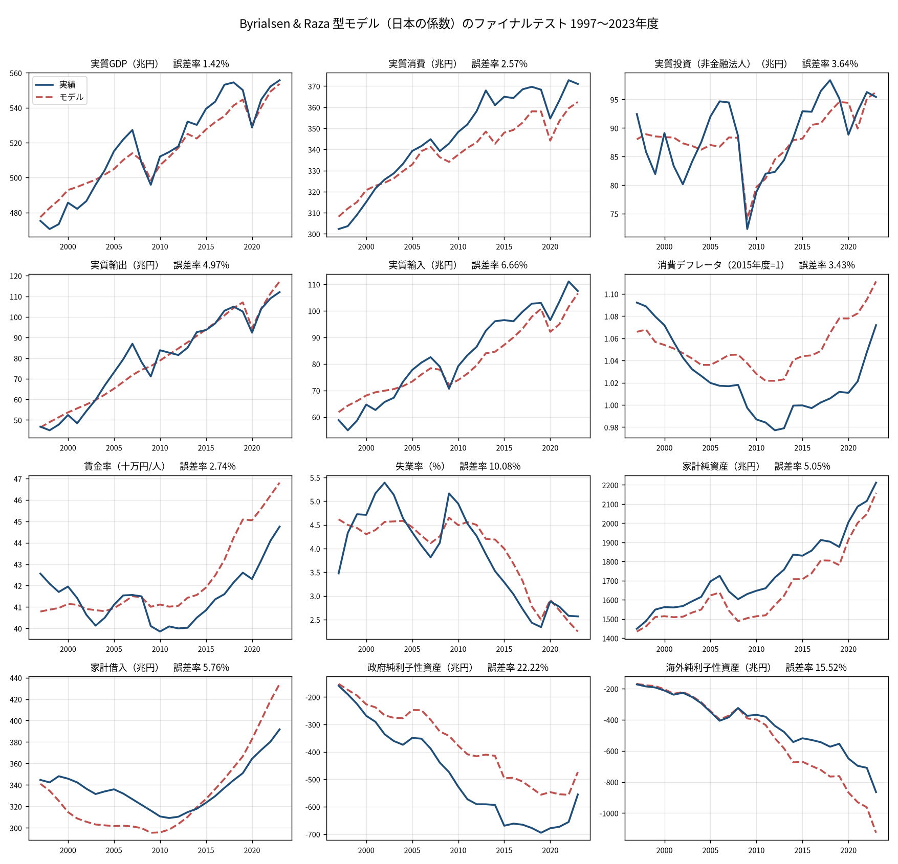
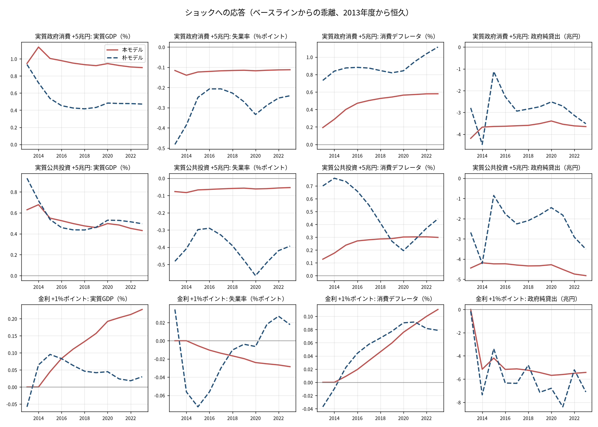

# Byrialsen & Raza の SFC モデルを日本のデータで動かす

Byrialsen, M. R. and H. Raza (2020) "An Empirical Stock-Flow Consistent
Macroeconomic Model for Denmark", Levy Economics Institute Working Paper No. 942
（以下 WP。掲載誌版は *Metroeconomica*, 2022）のデンマーク向け実証 SFC モデルを、
方程式の構造はそのままに、日本の国民経済計算で動かす試み。

WP は公開のワーキングペーパーである（https://www.levyinstitute.org/publications/an-empirical-stock-flow-consistent-macroeconomic-model-for-denmark）。
このディレクトリには WP の本文や PDF は置かず、方程式を書き写したものと、
それを日本のデータに当てはめるためのコードだけを置く。

## 進み具合

| 段階 | 内容 | 状態 |
|---|---|---|
| 1 | 5部門×3金融資産のデータセットを作り、会計恒等式を検算する（`aggregate.py`） | できた |
| 2 | WP 4.1〜4.5 節の方程式を写し、読み込めること・恒等式が実績を再現することを確かめる（`model.eq` `model.py`） | できた |
| 3 | 推定式14本を日本のデータで推定し直す（`estimate.py`） | できた |
| 4 | ファイナルテスト（1997〜2023年度を通しで解いて実績と比べる。`final_test.py`） | できた |
| 5 | 財政・金利ショックを解き、同じデータで動く朴モデルと比べる（`shocks.py`） | できた |

段階2までの数字：方程式 111 本（推定式 14、恒等式 97）、外生変数 81 本、
同時決定ブロックは家計の金融取引 4 変数と可処分所得・税の 2 変数の2つだけ。
推定式を外生化して恒等式だけを静学で解くと、実績との差は最大 0.3 十億円
（元の統計表が 0.1 十億円単位なので、その丸めの範囲）。

## ファイル

| ファイル | 役割 |
|---|---|
| `aggregate.py` | 国民経済計算（6部門×7資産）を WP の 5部門×3資産に畳み、実物側の変数・利子率・残差を付けて `japan_dk_fy.csv` を書く |
| `japan_dk_fy.csv` | できあがったデータセット（1994〜2023年度、195列） |
| `model.eq` | WP の方程式体系。EViews 風の表記で、本文の順に並べてある。推定式の係数はデンマークの値 |
| `estimate.py` | 推定式14本を日本のデータで OLS し、`model_jp.eq` と `estimates.md` を書く |
| `model_jp.eq` | `model.eq` の推定式14本を日本の係数に差し替えたもの（生成物。直接編集しない） |
| `estimates.md` | 係数・t値・R²・DW と WP の値の対照表（生成物） |
| `final_test.py` | 1997〜2023年度を通しで動学解し、誤差率を朴モデルと並べる。`dk_final.png` を書く |
| `shocks.py` | 政府消費・公共投資・金利のショックを両モデルで解き、乖離を並べる。`dk_shocks.md` `dk_shocks.png` を書く |
| `model.py` | `.eq` と CSV を読む（`coeffs="jp"` が既定、`"wp"` で WP の係数）。`identity_check()` が恒等式の検算 |
| `test_denmark.py` | 上の2つの検査（`python -m unittest models.denmark.test_denmark`） |

ソルバーは同じリポジトリの `sfcsim.py`、元データは `japan_*_fy.csv`（`fetch_*.py` が
内閣府「国民経済計算年次推計」などから作る）を共用する。朴モデルの方程式ファイルには
一切依存しない。

## 部門と資産の対応（WP 表1・表2）

| WP | 日本の国民経済計算（データ層の記号） |
|---|---|
| 家計 H | 家計（H） |
| 非金融法人 N | 非金融法人企業＋対家計民間非営利団体（N） |
| 金融機関 F | 金融機関。日本銀行を含む（F + CB） |
| 一般政府 G | 一般政府（G） |
| 海外 W | 海外（W） |
| 利子性資産 IB | 貨幣用金・SDR、現金・預金、債務証券、貸出・借入、金融派生商品、その他（GSH + GB + DEP + LBD） |
| 株式 EQ | 持分・投資信託受益証券（EQU） |
| 年金 PEN | 保険・年金・定型保証（PEN） |

WP どおり、家計だけ資産と負債を粗で持ち（IBA_H・IBL_H・EQA_H・PENA_H）、ほかの
部門は純額で持つ。金融機関は家計との利子性の取引を粗で持ち（IBA_FH = 家計の借入、
IBL_FH = 家計の預金など）、残りを純額 NIB_F とする。

組み替えは2つ。

- 一般政府の株式を政府の利子性資産に移す。相手方は非金融法人（株式の発行者）。
  WP 脚注7 が「NEQ^N・NIB^N とその取引・評価調整を調整する」と書いているとおり。
  日本では公的年金の株式保有が大きいので影響は小さくない
- 非金融法人の年金（退職給付債務など）を利子性資産に移す（相手方は金融機関）。WP の
  非金融法人は利子性資産と株式しか持たないため。デンマークでは無視できたのだろう。
  これは WP に無い組替えで、相手方の選び方はこちらの判断

家計の粗ポジションは、国民経済計算の残高表・取引表の資産側と負債側を別々に読んで
作る（利子性資産 1,225兆円、利子性負債 392兆円、2023年度末）。株式と年金は家計に
負債側が無い（原表でゼロ）ので、WP どおり純額＝資産。

## 日本のデータでの置き換え

| WP の変数 | ここでの作り方 |
|---|---|
| 利子率 r^A_H, r^L_H | 家計の受取利子・支払利子（翌年度）÷ 家計の利子性資産・負債（当年度末）。WP 3.2 節の式そのまま |
| 純利子性資産の利子率 r^N | 一般政府の純受取利子（翌年度）÷ 政府の純利子性資産（当年度末）。政府は純利子性資産しか持たないので、ここから取るのが最も素直 |
| 株式収益率 χ | 非金融法人の配当純受取 ÷ 前期末の純株式 |
| 年金収益率 ψ | 金融機関の純保険年金所得 ÷ 前期末の年金負債 |
| 輸出市場指数 m^W | 世界の実質GDP（IMF WEO、1994年度=100） |
| 住宅価格 P_H | WP 4.2 節どおり、住宅の評価調整 ÷ 前期末の住宅ストックを累積 |
| 投資デフレータ P_i | 総資本形成デフレータ。WP どおり4部門の実質投資すべてに同じものを使う |
| 消費・輸出・輸入・GDP のデフレータ | 名目 ÷ 実質の暗黙値（C = c·P_c などが厳密に成り立つように） |
| 労働力人口 LF、就業者 N | 労働力調査。N は国内居住の就業者、N_W = 賃金の海外純受払 ÷ 賃金率、LF = N + UN |
| 企業の税 T_N | 生産・輸入品に課される税（控除 補助金）＋法人の所得・富等に課される経常税 |
| 税率・減耗率・社会負担率（β_i, δ, β_7） | 実績の比率をそのまま外生変数に持つ（TAU_N, TAU_H, TAU_SC, DELTA_x） |

## WP との違い

方程式の構造は WP のままだが、日本のデータで恒等式を閉じるために次を加えている。

- `GAPNL_x`：資本勘定の純貸出と金融勘定の資金過不足の差。外生。WP には無い
  （デンマークのデータでは不突合が無いか、著者が調整したのだろう）
- `YR_GAP`：実質GDPと需要項目の合計との差。連鎖方式の実質値は足し上がらないため。外生
- `B2_N = B2 − B2_H − B2_F − B2_G`：非金融法人の営業余剰。WP 脚注10 は「残差」と
  書くだけで式一覧には無いので、1本立てた
- `NEQTR_N`（非金融法人の純株式取引）は外生。WP 本文は「受動的に他部門の需要を
  受け入れる」と書くが、式一覧には無い（非金融法人 19本に含まれない）。これを
  `−(他部門の合計)` にすると、金融機関の残差式 `NEQTR_F` と `NIBTR_F = −Σ` の
  ループが一次従属になり、金融機関の純取得を利子性と株式にどう割るかが1本ぶん
  決まらない（解けないのではなく不定）。外生（実績値）に置いて決める。
  株式市場は金融機関の残差で閉じる
- 金融機関の資本ストックの評価調整は WP では前期の添字が付いているが、当期とした
  （ほかの部門と同じ。誤植と判断）
- 単位労働費用は WP 4.5 節の書き方 `ULC = WS·Y / Y^F` をそのまま写した。標準的な
  定義（賃金 ÷ 実質GDP）とは違うので、推定の段階で見直す
- 税率・減耗率・社会負担率（β_i, δ, β_7）は WP どおり定数（`model_jp.eq`。原点を通る
  回帰で推定）。`model.eq`（WP の係数版）だけは恒等式の検算のために実績の比率を
  外生変数で持つ。日本は消費税率が3回変わっているので企業の税率は 0.088〜0.130 と
  動き、定数にするとファイナルテストの政府収支に誤差が乗る（WP と同じ条件）
- WP の ε（貯蓄の恒等式の開差）は外生。日本では海外部門の ε が GDP 比 6% と大きい。
  日本の対外純受取（直接投資収益・証券投資収益）が、WP の「1本の株式収益率 ×
  純株式」では表せないため

## 推定（段階3）

WP は 1995〜2016年のデンマークで、各説明変数を2ラグから始めて「一般から特殊へ」
絞る ARDL で推定している（5節）。ここでも同じ手順を日本の 1997〜2023年度で踏む
（`estimate.py` の冒頭に手順を書いてある）。

1. WP 本文が挙げる説明変数をラグ 0〜2（本文が t−i と書くものは 1〜2）で全部入れ、
   ラグ付き被説明変数も 1〜2 期入れる（一般形。式によって 4〜10 項）
2. |t| < 1.65 の項を小さいものから落とす。理論どおりの符号を持つ変数は最後の1本を
   残す（WP は有意でなくても符号が正しければ残している）
3. 残った項の符号が理論と逆なら落として 2 に戻る。WP は「符号が逆になった式は
   無かった」と書くが、日本では何本か逆になる
4. ダミーはデンマークの年を使わず、日本用の候補（2009 世界金融危機、2014 消費税率
   引上げ、2020 COVID）から t 値が 2 を超えるものだけ

やり方の違いは、定数項を全式に置くこと（単位が違うので水準の式には要る）と、
単位根・共和分の検定を省いていること。式の形（水準か Δlog か）は WP 付録の
最終形と同じ。比率の定数（企業の税率 0.107、家計の税率 0.072、社会負担率 0.188、
減耗率 非金融法人 0.099・住宅 0.062・金融機関 0.244・政府 0.031）も同じ期間で
原点を通る回帰で求め、`model_jp.eq` に入れてある。

結果は `estimates.md`（一般形と WP の最終形、残った項、落とした項）。

| 式 | 日本で残った形 |
|---|---|
| 消費 | 前期の純資産の伸び（t=4.4）だけ。可処分所得の伸びは当期・前期とも符号が逆で落ちた |
| 非金融法人の投資 | WP と同じ形。稼働率（y/k）の伸びの係数 2.0（WP 3.2） |
| 住宅投資 | 住宅価格／建設コストの伸びだけ（t=1.9）。所得は符号が逆 |
| 輸出 | 前期の輸出 0.53 と世界GDP 0.47（長期弾力性 1.0）。相対価格は符号が逆で落ちた |
| 輸入 | 前期の輸入 0.23 と民間需要 2.2（長期弾力性 2.9）。相対価格は符号が逆 |
| 家計の株式取引 | 前期の取引 0.76、株式収益率（+）、預金金利（−）、前期の借入（+）。**WP の3変数がすべて理論どおりの符号で残った**（段階3の最初の推定では定数だけだった） |
| 家計の年金取引 | 前期の取引と年金収益率。賃金総額は符号が逆 |
| 家計の借入 | WP の4変数がすべて理論どおり（住宅投資 0.28、前期債務 −0.03、金融資産取得 0.22、貸出金利 −6.0e5）＋前期の借入 0.52 |
| 営業余剰 | 前期の営業余剰 0.44 と名目GDP 0.21 |
| 社会給付 | 前期の失業者数（t=5）と時間トレンド。賃金率は符号が逆 |
| 消費者物価 | 賃金率の伸び（当期 0.53、2期前 0.23）と輸入価格の伸び 0.04 |
| 輸出価格 | 前期の伸び 0.30、輸入価格 0.49、単位労働費用 0.24（WP 0.27） |
| 就業者 | 当期の実質GDP 0.13 と労働力人口 1.27。ラグ付き被説明変数は落ち、DW 0.5 と自己相関が残る |
| 賃金率 | 前期の変化 0.81、失業率の変化 −129（WP −101）と前期 +67（WP +89） |

一般から特殊へに変えて改善したのは家計の株式取引（定数だけ → WP の3変数）と
輸出・輸入（ラグ付き被説明変数が入って当てはまりが上がった）。変わらないのは
消費式に所得が入らないこと。日本の年次データでは、家計の実質可処分所得の伸びと
実質消費の伸びの相関が弱く（消費税率引上げの駆け込みと反動、COVID の強制貯蓄）、
どのラグでも符号が逆になる。

## ファイナルテスト（段階4）

初期値だけ実績にして 1997〜2023年度を通しで動学解した。減衰も受け入れ条件も
無しで最終年度まで解ける。誤差率（MAPE）を、同じデータ・同じ期間で動く朴モデルの
ファイナルテストと並べる（朴モデルは `python park_test.py` の出力）。

| 変数 | 本モデル | 朴モデル |
|---|---:|---:|
| 実質GDP | 1.4% | 1.3% |
| 名目GDP | 2.9% | 1.4% |
| 実質消費 | 2.6% | 1.3% |
| 実質投資（非金融法人） | 3.6% | 3.2% |
| 名目住宅投資 | 13.8% | 4.3% |
| 実質輸出 | 5.0% | 4.8% |
| 実質輸入 | 6.7% | 4.3% |
| GDPデフレータ | 3.5% | 1.7% |
| 消費デフレータ | 3.4% | 1.5% |
| 賃金率 | 2.7% | 2.1% |
| 就業者数 | 0.4% | 1.5% |
| 失業率 | 10.1% | 43.7% |
| 家計可処分所得 | 2.5% | 1.7% |
| 家計純資産 | 5.1% | 1.0% |
| 政府純利子性資産 | 22.2% | （定義が違う） |
| 海外純利子性資産 | 15.5% | （定義が違う） |

読み方。

- 実質の需要項目は朴モデルと同じ程度に追える。推定式14本の小さなモデルとしては
  十分で、需要主導の SFC モデルが日本の実物側を説明できることを示している
- **労働市場は本モデルのほうがよい**。失業率の誤差率 10.5%（朴モデル 43.7%）、
  就業者数 0.4%。朴モデルは生産関数からの GDP ギャップが賃金式に入って失業率が
  暴れるが、本モデルは就業者を実質GDPと労働力人口で直接説明し、賃金を失業率の
  変化のフィリップス曲線で決めるだけなので安定している
- **物価と名目値は朴モデルより粗い**。消費者物価と輸出価格の2本しか価格の式が
  無く（朴モデルは需要項目ごとのデフレータを持つ）、GDPデフレータは名目÷実質の
  結果として出るだけなので、誤差率が 3〜4% になる。名目GDP・賃金・家計純資産の
  誤差はここから来ている
- 住宅投資は弱い（誤差率 13.8%）。推定の段階で住宅価格の項しか残らなかったとおり
- 政府の純利子性資産が 22% ずれる。企業の税率を WP どおり定数にしたため、消費税率
  の引上げ（1997・2014・2019年度）による税収の段差が追えず、政府収支の誤差が
  累積する。実績の税率を外生に戻せば 6% に収まる（`model.eq` の扱い）
- 海外の純利子性資産は 16% ずれる。海外部門の貯蓄式の残差 ε_W が GDP 比 6% と
  大きい（日本の対外純受取を1本の収益率で表せない）ことの帰結で、ここは日本向けに
  資産別の収益率を持たせるのが筋

図は `dk_final.png`（実績とモデル、12 変数）。



## ショック（段階5）

WP 5.2 節（財政）・5.3 節（金利）にならい、3つのショックを 2013年度から恒久的に
入れて、ベースライン（2010年度起点の動学解。朴モデルの反実仮想と同じ作法）からの
乖離を両モデルで並べた。表の全体は `dk_shocks.md`、図は `dk_shocks.png`。

| ショック | 指標 | 本モデル | 朴モデル |
|---|---|---:|---:|
| 実質政府消費 +5兆円 | 実質GDP乗数（1年目 → 6年目） | 1.00 → 1.02 | 1.00 → 0.46 |
| | 政府金融純資産（11年目、兆円） | −40 | −31 |
| 実質公共投資 +5兆円 | 実質GDP乗数（1年目 → 6年目） | 0.66 → 0.52 | 1.00 → 0.48 |
| 金利 +1%ポイント | 実質GDP（11年目、%） | +0.23 | +0.03 |
| | 実質消費 ／ 設備投資（11年目、%） | +0.63 ／ +0.19 | +1.12 ／ −3.86 |
| | 政府金融純資産（11年目、兆円） | −52 | −63 |

読み方。

- **政府消費の乗数は本モデルのほうが大きく、減衰しない**（1.0 前後）。WP の輸入関数は
  民間需要（c + i + x）だけを説明変数にしているので、政府消費は輸入に漏れない。
  加えて設備投資が稼働率（y/k）で増える。朴モデルは物価と輸入を通じて 0.5 まで
  減衰する
- **公共投資の乗数は本モデルのほうが小さい**（0.5〜0.7）。同じ輸入関数の投資の項に
  乗るので、長期弾力性 2.9 で半分近くが輸入に漏れる。政府消費との非対称は WP の
  輸入関数の仕様から来ていて、日本向けには輸入関数に政府需要も入れるほうが素直
- **金利を上げると GDP がわずかに増える**のは両モデルで共通。日本の家計は純債権者
  なので利子所得が増え、消費が増える。朴モデルは設備投資に金利が入っていて −3.9%
  と大きく減るが、WP の投資関数は稼働率だけなので本モデルの投資は減らない。
  WP がデンマークで報告する「金利上昇 → 家計の利払い増 → 消費減」とは逆で、
  家計の粗債務の大きさの違いがそのまま出ている
- 本モデルはショックの初年度にほとんど反応しない（消費は前期の純資産、投資は前期の
  稼働率で決まる）。朴モデルは初年度から物価・賃金・失業率が動く
- 政府の金融純資産の悪化はどのショックでも同じ程度（10年で 30〜60兆円）



## 使い方

リポジトリの root で。

```bash
python models/denmark/aggregate.py     # japan_dk_fy.csv を作り直す（国民経済計算の Excel が cache/ に要る）
python models/denmark/model.py         # 本数・ブロック構造・恒等式の検算
python models/denmark/estimate.py      # 推定式14本を日本で推定 → model_jp.eq / estimates.md、パーシャルテスト
python models/denmark/final_test.py    # ファイナルテスト → dk_final.csv / dk_final.png、朴モデルとの比較
python models/denmark/shocks.py        # 財政・金利ショック → dk_shocks.md / dk_shocks.png（朴モデルも解くので数分）
python -m unittest models.denmark.test_denmark
```

```python
import sys; sys.path.insert(0, "models/denmark")
import model as dk
m, d = dk.load()          # sfcsim.Model（日本の係数）と DataFrame。dk.load("wp") で WP の係数
m.exog()                  # 外生変数 81 本
dk.identity_check()       # 変数ごとの最大誤差
```

`model.eq` の推定式14本の係数は WP のデンマークの値のまま（構造の記録として残す）。
動かすときは `estimate.py` が作る `model_jp.eq` を使う。

## 公開にあたって

切り出しの手順は `PUBLISHING.md`、切り出しと検査は `export_public.py`（履歴を持たない
スナップショット。禁止文字列と論文の材料の有無を検査し、出力先でテストを走らせる）。

- 方程式は公開のワーキングペーパーから書き写したもので、WP を引用する。PDF は再配布しない
- データはすべて内閣府・総務省・厚生労働省・経済産業省・IMF の公表統計から作る
- このディレクトリと、共用する `sfcsim.py`・`fetch_*.py`・`japan_*_fy.csv` だけで動く。
  朴モデルの方程式や論文の本文には依存しない
- ライセンスは公開時に決める

## 参考文献

- Byrialsen, M. R. and H. Raza (2020) "An Empirical Stock-Flow Consistent Macroeconomic Model for Denmark", Levy Economics Institute Working Paper No. 942.
- Byrialsen, M. R. and H. Raza (2022) "An empirical stock-flow consistent macroeconomic model for Denmark", *Metroeconomica*.
- Godley, W. and M. Lavoie (2012) *Monetary Economics*, 2nd ed., Palgrave Macmillan.
